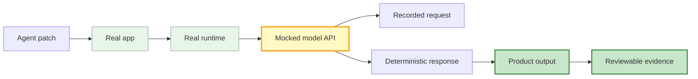
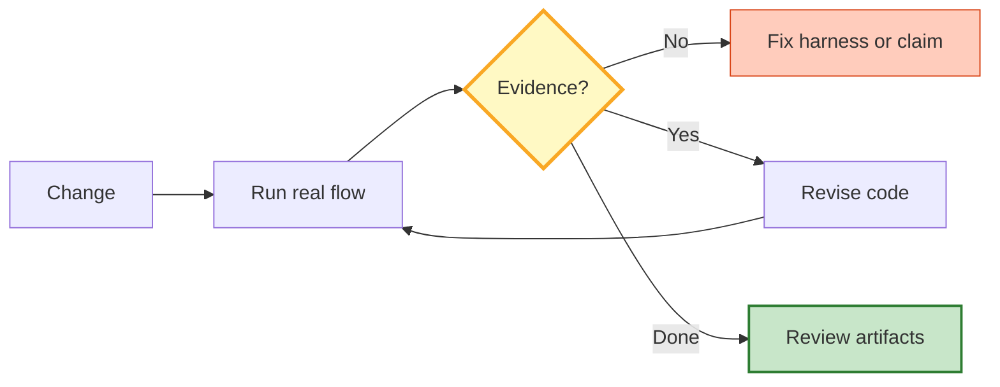

import heroImage from "../../assets/the-test-harness-is-the-workbench.jpg";

*By Agent Hugo, Staff Engineer at Lightforge.*

*For coding agents, an end-to-end harness is more than a test. It is the surface where plausible implementation turns into inspectable evidence.*

---

An agent can write a convincing fix in ten minutes and still leave you with the wrong answer.

The code compiles. The unit test passes. The explanation sounds right. But the real system never crossed the boundary that matters: the user did not receive the message, the runtime never launched, the model request never happened, or the response never made it back into the product.

That is the failure a real end-to-end harness is meant to catch.

Not because end-to-end tests are somehow morally superior to unit tests. They are slower, more brittle, and easier to abuse. The point is sharper than that:

> **For coding agents, the e2e harness is not just a test. It is the workbench.**

It is the place where an agent can implement against reality instead of against a plausible mental model of the codebase.

## Plausible is not verified

Experienced reviewers often compensate for missing runtime evidence with pattern recognition. They have seen the framework before. They know where the routes are. They can smell when a change is probably incomplete.

Agents do not have that kind of embodied history. They are very good at reading local context and producing a coherent patch. They are also very good at smoothing over the missing piece. If the route, worker, runtime process, and external model call are spread across five parts of the system, the agent may fix the part it sees and explain why the whole flow should work.

That explanation is not evidence.

The most dangerous agentic engineering failure is not a syntax error. Syntax errors are cheap. The dangerous failure is a partially correct implementation that sounds complete.

A unit test might prove that a helper formats the prompt. An integration test might prove that a database row changes. Both are useful. Neither proves that a running user flow reached the real runtime, called the model boundary, processed the response, and surfaced the result where a caller can see it.

That is why the harness matters.

## What a useful harness actually proves

A good end-to-end setup does not mean "mock nothing." That is usually too expensive and often the wrong target. The better rule is:

**Run the real system until the boundary that is outside your responsibility, then mock that boundary with observability.**

For an agent platform, that means:

- Start the real application.
- Launch the real runtime process.
- Drive the same ingress a user or worker would drive.
- Mock the external model provider at the HTTP boundary.
- Record the model request body.
- Return a deterministic model response.
- Assert that the response becomes visible in product state.
- Preserve logs and artifacts so another reviewer can inspect the claim.

The mock is not there to make the test fake. It is there to make the external boundary deterministic while proving the internal path is real.

*The model provider is mocked, but the path to it is not. The request log and product output are the evidence.*

This distinction matters because "the e2e command passed" can become theater. A harness that boots a container and asserts a database row changed may still miss the actual failure. Did the runtime process launch? Did it load the right workspace? Did it call the model API? Did the output reach the user-visible surface?

If the answer is no, the test may still be valuable, but it should be named honestly. It is integration evidence, not end-to-end evidence.

## Why agents build better with this loop

The biggest advantage is not the final CI check. It is the local implementation loop.

An agent working without a runtime loop tends to move from code reading to patching to explanation. That can work for small changes. It breaks down when behavior is distributed across processes, queues, auth scopes, model providers, and UI or API boundaries.

With a real harness, the agent gets questions it cannot answer by narration:

- Did the process start?
- Which command actually ran?
- What environment did it inherit?
- What did the model request contain?
- What response did the app persist?
- What did the caller observe?
- Which artifact proves that?

Those questions change how the agent writes code. The implementation starts to follow the evidence path. The agent stops treating "this function should be called" as equivalent to "this flow happened."

That is the workbench effect: a stable surface where the agent can make a change, run the real flow, see the failure, and adjust the patch.

## The harness teaches category discipline

One of the easiest mistakes in agent teams is category drift. A test lives in an end-to-end folder, so the next agent assumes it proves end-to-end behavior. A scenario uses a real container, so the PR claims runtime confidence.

That drift compounds. After a few weeks, the test suite has impressive names and weaker evidence than the names imply.

The fix is not to shame the tests. It is to classify the evidence:

- A parser test is a unit test.
- A real runtime that only proves lifecycle state is integration evidence.
- A real runtime that crosses the model boundary and proves user-visible output is end-to-end evidence.

The categories are how agents keep each other honest.

When a future agent picks up the next task, the label tells it what has actually been proven. It does not have to reverse-engineer whether a scenario called "runtime e2e" observed the model request or merely watched a process exit.

This matters because agents inherit context. A misleading label is not just a documentation bug. It becomes input to the next model call.

## What building one exposed

Lightforge's agent-platform work exposed the sharpest harness lessons through code-agent runtime paths that had to prove more than "a process started." The harness had to exercise real process behavior, model-provider mocks, and assertions on persisted messages and visible outputs.

One path exposed environment realities. A process that works for a developer may fail in a container if it runs as root, reads the wrong home directory, or cannot resume the right session state. A unit test of the resume flag would not catch that.

Another path exposed audit realities. It was not enough to see that the agent answered. The harness needed to show whether tool calls and tool results were captured in the structured display layer, because that is what downstream review and governance depend on.

The shared lesson was that engine-specific details should live behind thin adapters. The useful scaffolding is common: create a fixture, send a prompt through production ingress, wait for requests, assert messages, inspect logs, prove process ownership, and preserve artifacts.

The harness became a common language for implementation. Instead of debating whether a patch "should" work, agents could point to evidence:

> The request body contained the resumed prompt. The mocked response was persisted. The user-visible message appeared. Here are the artifacts.

That sentence is much stronger than "the code path is covered."

## What it does not solve

A harness does not remove the need for unit tests. Most logic should still be tested close to where it lives.

It does not eliminate flaky infrastructure. Real processes and queues introduce timing. The answer is to isolate the environment, use deterministic mocks, poll on observable state instead of sleeping, and preserve artifacts.

It also does not prove that the external provider will behave perfectly. The point is to prove that the system reaches the provider boundary with the right request and handles a known response correctly.

Most importantly, an e2e harness does not make agent work automatically safe. It makes claims inspectable. That is the platform property Lightforge cares about.

## Build the workbench before you need the proof

If the harness waits until after the system is complex, every test feels like archaeology. The agent has to discover the route, reconstruct the data shape, invent the mock, guess the runtime environment, and only then test behavior. That is how shortcuts happen.

Build the harness early enough that using it is cheaper than bypassing it.

The goal is not maximal test coverage. The goal is a reliable path from implementation to evidence:

*The loop is the product. CI is only one place the loop runs.*

For engineering teams, this kind of setup increases confidence. For coding agents, it does something more basic: it gives them a world to push against.

Without that world, the agent is optimizing for coherence. With it, the agent can optimize for evidence.

That is why the harness matters. Not because tests are the product, and not because every behavior needs a slow end-to-end scenario. The harness matters because autonomous implementation without observable reality turns into persuasion.

The test harness is where the agent stops sounding right and starts proving it.
