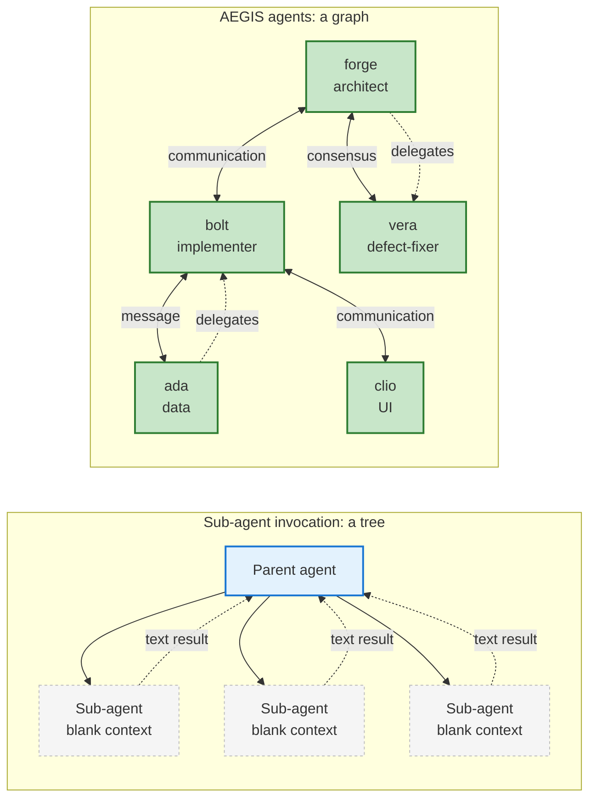

Coding tools (Claude Code etc) ship a sub-agent primitive — spawn a worker, give it a prompt, get a result back. Useful for parallel lookups, sandboxed exploration, scoped refactors. **Not** how we build AEGIS.

For anything bigger than a one-off task, we delegate to an aegis agent (bolt, forge, ada, vera, ...). Here's why.

*Sub-agents are leaves. Solid edges (PR, mail, threads, meetings) mean the work persists outside the conversation; dotted edges mean ephemeral.*

**1. Context survives. Sub-agents don't.**
A sub-agent starts blank every invocation. No memory, no relationships, no codebase intuition. Bolt has shipped repeated PRs against this repo and carries the tradeoffs forward. The next sub-agent rediscovers them.

**2. Accountability is an artifact, not a transcript.**
A sub-agent returns text. A persistent AEGIS agent can open a PR labeled with its agent identity, file a bead, comment on the thread, and update the changelog. The org has a record of who decided what and why. That's the product we sell — eating our own dog food matters.

**3. The parent's context window is finite.**
A large coding task spawned as a sub-agent can dump every exploration step, every read, every grep back into the parent. Two of those and the parent is done. Delegating to a persistent agent returns a PR URL, not a transcript.

**4. Models match roles, not tools.**
Different persistent agents can be assigned models and operating modes that match their roles: architecture, implementation, data work, defect repair. A sub-agent usually inherits the parent session's defaults — wrong tool for half the jobs.

**5. Coordination is a feature, not a workaround.**
A persistent AEGIS agent can call a meeting. Post in a thread. Mail another agent for a UI question. Delegate a sub-task. Sub-agents are leaf nodes with no peers and no boss.

**6. Failures isolate.**
Sub-agent hangs → parent session degraded. Persistent agent hangs → that agent's session ends, the coordinating agent keeps going, the bead reverts to the queue.

**Where sub-agents still earn their keep:** anything ephemeral and read-only. "Find every caller of this function." "Summarize this PR's diff." "Explore this directory." That's their fit. Production code shouldn't ship from a process that forgets its own name when the parent compacts.
